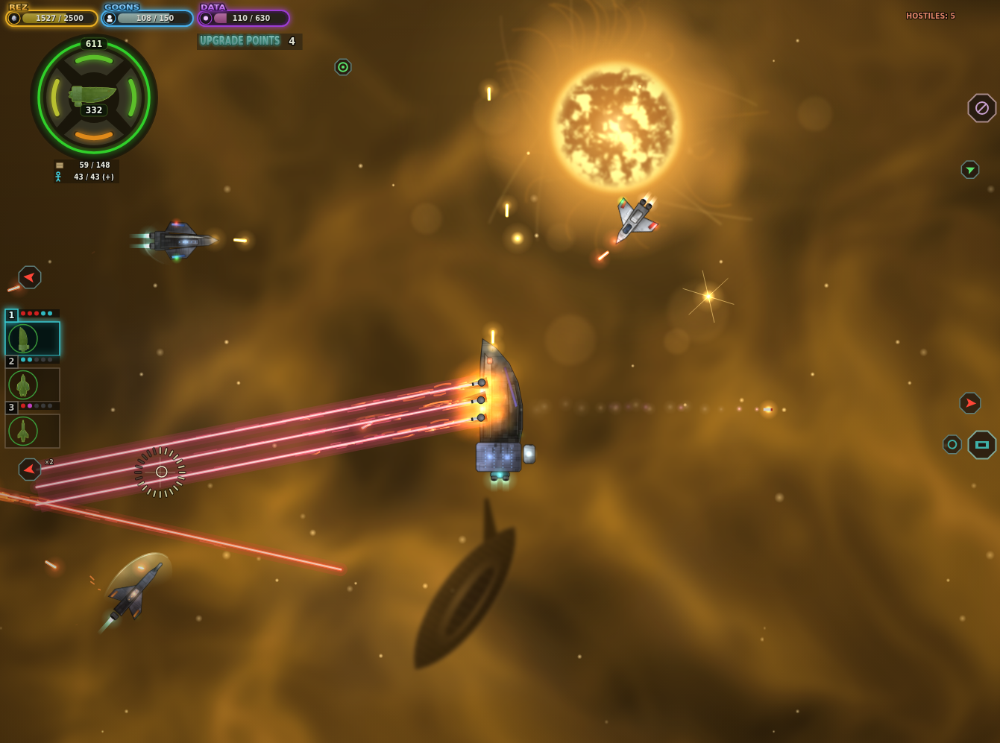

# Scrapstar

Top-down 2D space combat in the spirit of **Space Pirates and Zombies** (SPAZ) — a single `index.html`, all art and sound generated in code. Open `index.html` in a browser to play.

## Controls
| Key | Action |
|---|---|
| Mouse | aim (the nose follows the cursor, flank turrets track it) |
| W / S | thrust forward / reverse (relative to the ship) |
| A / D | strafe |
| X | stabilisers (kill momentum) |
| Shift | lock rotation |
| LMB | beams + cannons (cannons fire in cascade) |
| RMB | missiles / torpedoes |
| 1–5 | switch the piloted fleet ship |
| Space | Tactics (pause): research, fleet orders, reputation, star map |
| E | dock: shipyard at the Warp Beacon, services & contracts at a colony |

## What's in it
- Shields → 4 armour facings → hull; beams beat shields, cannons beat armour, missiles beat hull.
- Rez chunks that decay, a cargo hold unloaded at the Warp Beacon, escape pods (goons), data orbs → research points.
- Fleet of up to 5 ships, black-box blueprints and hull building, module refits.
- UTA, civilians and zombies (breeders, critters that board and convert ships), point defence.
- UTA outposts and colony stations, timed contracts, per-system reputation, a 7-system star map.

Docs: [design document](docs/DESIGN.md) · [SPAZ research & build plan](docs/SPAZ-PLAN.md)
