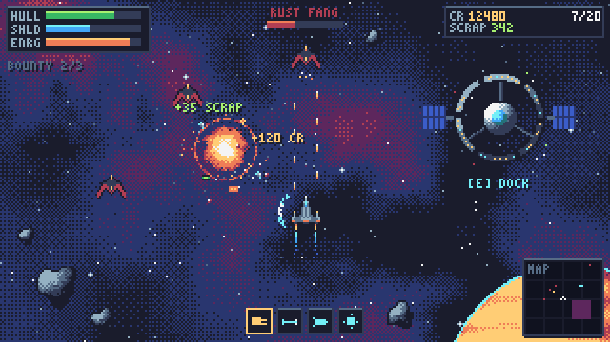
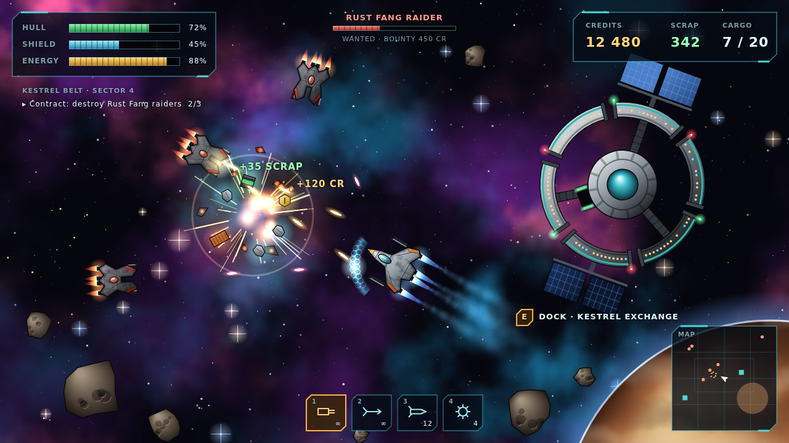
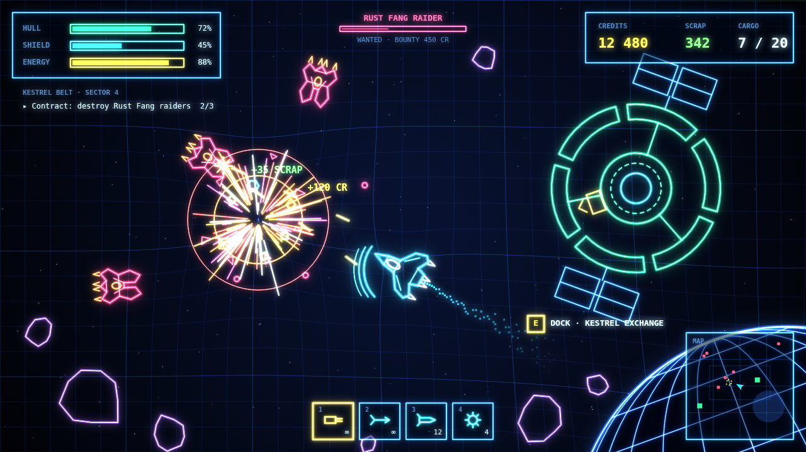
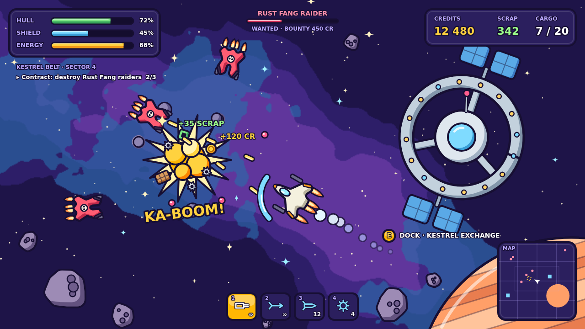
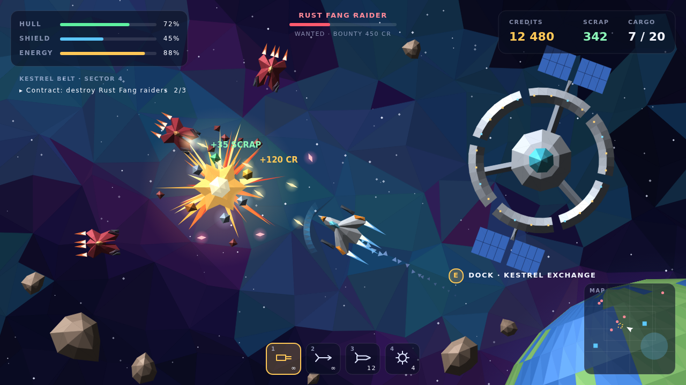

# Scrapstar — дизайн-документ

*Версия 0.1 — черновик для обсуждения*

## 1. Питч

**Scrapstar** — 2D-космическая стрелялка с видом сверху. Ты пилот-одиночка на ржавой окраине галактики: летаешь с инерцией, дерёшься с пиратами, собираешь лом и груз с обломков, торгуешь на станциях, ставишь на корабль модули получше и пробиваешься от пилота «Щепки» до легенды сектора.

Одна сессия — 15–40 минут: вылет со станции → бой и сбор лута → продажа и апгрейд → вылет в более опасную систему.

**Референсы:**
- *Space Pirates and Zombies* — главный ориентир: бой, лут, модульный корабль, фракции, зараза на поздних этапах;
- *Escape Velocity* и *Transcendence* — торговля, карьера, открытый сектор;
- *Asteroids* и *Geometry Wars* — ощущение инерции и стрельбы.

## 2. Основной цикл

```
     ┌──────────────► ВЫЛЕТ В СИСТЕМУ ◄──────────────┐
     │                      │                         │
     │                      ▼                         │
 АПГРЕЙД КОРАБЛЯ         БОЙ / ДОБЫЧА            КОНТРАКТ
 (модули, корпус)           │                    (задание)
     ▲                      ▼                         ▲
     │                    ЛУТ                         │
     │          (лом, кредиты, груз, модули)          │
     │                      │                         │
     └──────── СТАНЦИЯ: продажа, ремонт, торговля ────┘
```

Каждый круг должен давать ощутимый прогресс: новый модуль, рост репутации или новую открытую систему.

## 3. Управление и ощущение полёта

- **Мышь** — прицел; корабль плавно доворачивает носом к курсору.
- **W / S** — тяга вперёд и назад, **A / D** — боковые манёвровые двигатели.
- **Shift** — форсаж: тратит энергию.
- **ЛКМ / ПКМ** — основное и вспомогательное оружие, **1–4** — выбор оружия.
- **E** — стыковка, **Tab** — карта сектора.
- Физика с инерцией и небольшим «космическим трением», чтобы корабль не улетал бесконечно. У каждого корпуса своя масса: тяжёлый медленно разгоняется, лёгкий вёрткий.

## 4. Корабль

Корабль = **корпус + модули в слотах**.

| Корпус | Роль | Слоты (оружие / утилиты) | Особенность |
|---|---|---|---|
| Щепка | стартовый | 2 / 1 | дешёвый и хрупкий |
| Шакал | истребитель | 3 / 1 | быстрый, мало груза |
| Мул | грузовик | 1 / 3 | большой трюм, медленный |
| Барракуда | тяжёлый боец | 4 / 2 | много брони, дорогой |
| Ковчег | поздняя игра | 4 / 4 | покупается за репутацию |

**Модули:**
- **двигатель** — тяга и манёвренность;
- **реактор** — энергия и её восстановление;
- **щит** — ёмкость и скорость восстановления;
- **броня** — прочность корпуса;
- **утилиты**: грузовой отсек, магнит для лута, сканер, ремонтные дроны, маскировка.

У модулей есть **редкость** (обычный → улучшенный → редкий → экспериментальный) и случайные **свойства**, например «+15% скорострельности» или «щит восстанавливается во время форсажа». Поэтому интересно проверять каждый выпавший модуль.

## 5. Бой

- **Щит и корпус.** Щит восстанавливается сам от реактора. Корпус чинится только ломом или на станции.
- **Типы урона.** Кинетический (пушки, рельсы) хорош против корпуса, энергетический (лазеры) — против щита, взрывной (ракеты, мины) бьёт по площади.
- **Оружие:** автопушка, лазер, ракеты с самонаведением, мины, рельсотрон, буксирный луч (подтянуть лут или врага).
- **ИИ врагов по ролям:**
  - налётчик кружит вокруг и стреляет;
  - тяжёлый идёт напролом;
  - снайпер держит дистанцию;
  - трус бежит, когда корпус ниже 30%, и уносит свой груз.
- Враги бывают **группами с лидером**: если сбить лидера, остальные могут разбежаться.

## 6. Лут

Из подбитых кораблей и контейнеров выпадает:

| Лут | Зачем |
|---|---|
| **Лом** (scrap) | ремонт, крафт и улучшение модулей; главный ресурс |
| **Кредиты** | покупки на станциях |
| **Груз** (контейнеры) | товары для продажи (см. торговлю) |
| **Модули** | редкая находка, можно поставить сразу или продать |
| **Данные** | открывают чертежи и новые системы на карте |

Лут висит в пространстве около 30 секунд и подлетает к кораблю, если есть магнит. Хорошо работает жадность: пока собираешь лом, подлетает вторая волна.

## 7. Торговля

- Товары: руда, вода, еда, медикаменты, электроника, оружие и контрабанда (синтетика).
- Каждая станция что-то **производит** (продаёт дёшево) и **потребляет** (покупает дорого).
- Цены живые: если привезти много, цена падает; со временем восстанавливается.
- **События** меняют цены. Пираты перекрыли маршрут — на отрезанной станции дорожает еда. Вспышка заразы — дорожают медикаменты.
- Контрабанду покупают дорого, но патруль Флота сканирует трюм.

## 8. Карта сектора

- Сектор — это **граф из 20–30 звёздных систем**, связанных прыжковыми воротами.
- Каждая система — отдельная 2D-арена: станции, астероидные пояса, обломки, ворота.
- У системы есть **уровень опасности** (1–5) и **хозяин** — одна из фракций.
- В начале открыты только ближние системы, остальные скрыты «туманом» до первого визита или до покупки данных.
- Сектор живёт: фракции со временем отбивают друг у друга системы, а зараза расползается.

## 9. Фракции

| Фракция | Кто это | Что даёт |
|---|---|---|
| **Биржа «Кестрел»** | торговцы, хозяева станций | торговля, контракты на доставку и эскорт |
| **Флот Периметра** | власть и полиция | награды за пиратов, военные модули; не любит контрабанду |
| **Ржавые Клыки** | пираты | набеги на караваны, чёрный рынок, дешёвое оружие |
| **Братство Свалки** | мусорщики, нейтралы | покупают лом дороже всех, чинят и перекраивают модули |
| **Пустые** | «зомби»: корабли, заражённые нанитовой гнилью | угроза для всех на поздних этапах; поднимают подбитые корабли и заражают системы |

Репутация у каждой фракции своя, от «враг» до «союзник». Поступки влияют сразу на несколько фракций: если грабишь караван Биржи, растёт репутация у Клыков и падает у Биржи и Флота.

## 10. Карьера

Четыре пути. Их можно смешивать, но ранги растут отдельно:

- **Торговец** — прибыль и доставки. Финал: своя торговая станция.
- **Охотник за головами** — контракты Флота. Финал: охота на главаря Ржавых Клыков.
- **Пират** — грабёж и контрабанда. Финал: захват системы для Клыков.
- **Мусорщик** — лом, разборка и редкие модули. Финал: собрать экспериментальный корабль из частей.

**Общая угроза.** Во второй половине игры Пустые начинают захватывать сектор. Их нужно остановить на любом пути, иначе они поглотят все станции. Финальная цель игры — уничтожить матку Пустых. Звание **Scrapstar** получает пилот, закрывший финал своего пути и победивший матку.

## 11. Риск и смерть

- При гибели корабля теряется весь груз и половина лома. Пилот катапультируется на последнюю станцию.
- **Страховка** (покупается на станции) возвращает корпус и модули. Без неё придётся начинать на Щепке.
- Опционально — **хардкор-режим**: одна жизнь.

## 12. Визуальный стиль — 5 вариантов

Ниже одна и та же сцена в пяти стилях: игрок сбивает пирата, рядом взрыв и лут, справа станция, внизу планета, на экране интерфейс. Все картинки нарисованы кодом (canvas) как **макеты**: это не скриншоты игры, а примеры того, как она может выглядеть.

### В каком стиле нарисована Space Pirates and Zombies?

Это **не пиксель-арт**. В SPAZ детализированные 2D-спрайты высокого разрешения:
- металлические корпуса с панелями и цветными полосами фракций;
- чёткие силуэты;
- яркие светящиеся эффекты: выстрелы, двигатели, взрывы с кучей частиц;
- красочные туманности на фоне.

По ощущению это ближе к «рисованной» или отрендеренной графике, чем к ретро-стилю. Вариант 2 ниже — попытка передать именно этот вид.

---

### Вариант 1 — Пиксель-арт



Разрешение 320×180, увеличенное в 4 раза, палитра из 16 цветов, туманность через дизеринг.

- **Плюсы:** узнаваемый ретро-вид; хорошо читается в бою; ассеты маленькие; много любителей жанра.
- **Минусы:** очень популярный стиль, трудно выделиться. Корабли поворачиваются под любым углом, а для пиксель-арта это неудобно: придётся рисовать 16–32 направления для каждого спрайта или мириться с «рваными» поворотами.

### Вариант 2 — Как в SPAZ (рисованные спрайты со свечением)



Металлические корпуса с градиентами и деталями, цветные полосы фракций, светящиеся двигатели и выстрелы, мягкая туманность.

- **Плюсы:** ближе всего к референсу; самая «богатая» и атмосферная картинка; взрывы и лут эффектно смотрятся.
- **Минусы:** самый дорогой стиль по контенту: каждый корпус и модуль нужно прорабатывать. В бою много свечения, приходится следить, чтобы не терялась читаемость.

### Вариант 3 — Неоновый вектор



Светящиеся линии на тёмной сетке, которая прогибается вокруг взрывов и планеты. Наследник *Asteroids* и *Geometry Wars*.

- **Плюсы:** самый дешёвый в производстве, всё рисуется кодом; отличная читаемость; эффектные взрывы; модули легко показать линиями.
- **Минусы:** мало «вещественности». Лом, груз и ржавые станции плохо передаются линиями, поэтому тема «мусорщика и торговца» теряется.

### Вариант 4 — Мультяшный (cel-shading, толстый контур)



Плоские цвета с одной тенью, жирный тёмный контур, пухлые формы, звёзды-искорки, надписи в духе комиксов.

- **Плюсы:** дружелюбный и запоминающийся, хорошо выделяется среди «серьёзного» космоса; прекрасная читаемость; хорошо рисуется кодом.
- **Минусы:** снимает драму. Зомби-угроза Пустых и суровая пиратская окраина будут смотреться несерьёзно, если это не входит в замысел.

### Вариант 5 — Low-poly (гранёные плоские полигоны)



Всё собрано из треугольников с плоским освещением: корабли, астероиды, станция, фон-мозаика и граненая планета. Интерфейс минималистичный и современный.

- **Плюсы:** современный вид; всё генерируется кодом, свет на всех объектах одинаковый; легко делать сотни вариантов кораблей и модулей из полигонов, что идеально ложится на модульную сборку.
- **Минусы:** без хорошей палитры может выглядеть «технодемкой». Фон нужно держать спокойным, чтобы не спорил с кораблями.

### Рекомендация

- **Хочется максимально похоже на SPAZ** — вариант 2. Но рассчитывайте, что на графику уйдёт больше всего времени.
- **Лучший баланс «красиво / быстро / масштабируется»** — вариант 5 (low-poly). Модульные корабли, случайные модули и много видов врагов в нём делаются кодом без художника, а картинка выглядит цельно.
- Неон и мультяшный стиль хороши, но меняют настроение игры. Их стоит выбирать, только если оно и нужно.

## 13. Техника

- **HTML5 Canvas 2D + JavaScript** (ES-модули), без движка и без сервера.
- Игра открывается в браузере, выкладывается бесплатно на **GitHub Pages**.
- Фиксированный шаг симуляции 60 Гц, отрисовка отдельно.
- Сохранения в `localStorage`, экспорт и импорт сейва файлом.
- Графика генерируется кодом, как в макетах. Звук — Web Audio.

## 14. План прототипа

1. **Полёт** — корабль с инерцией, камера, фон, астероиды.
2. **Бой** — оружие, пираты с простым ИИ, щит и корпус, взрывы.
3. **Лут** — выпадение, магнит, инвентарь, лом и кредиты.
4. **Станция** — стыковка, магазин, продажа, ремонт, установка модулей.
5. **Сектор** — несколько систем, ворота, карта.
6. **Карьера** — контракты, репутация, ранги, первые события сектора.

После этапа 3 уже можно играть: летать, стрелять и собирать. После этапа 4 появляется полный основной цикл.

## 15. Открытые вопросы

- Какой визуальный стиль выбираем?
- Управление: мышь + WASD (как описано) или «танковое» — поворот на A/D?
- Язык интерфейса: русский, английский или оба?
- Оставляем ли зомби-угрозу (Пустых) или делаем чисто пиратскую историю?
- Нужен ли когда-нибудь кооператив или игра строго одиночная?
